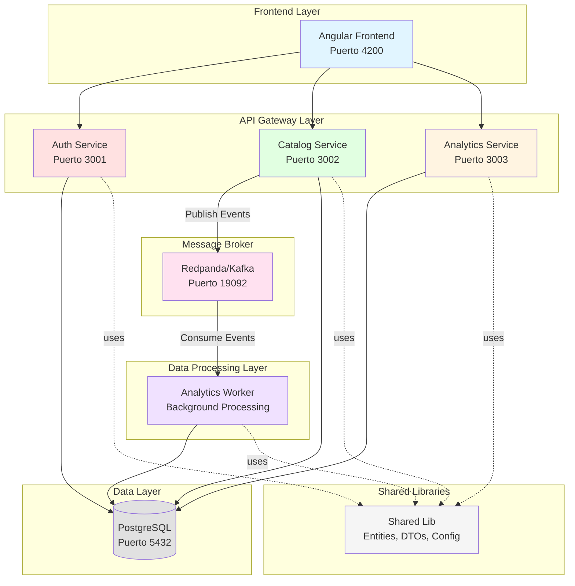
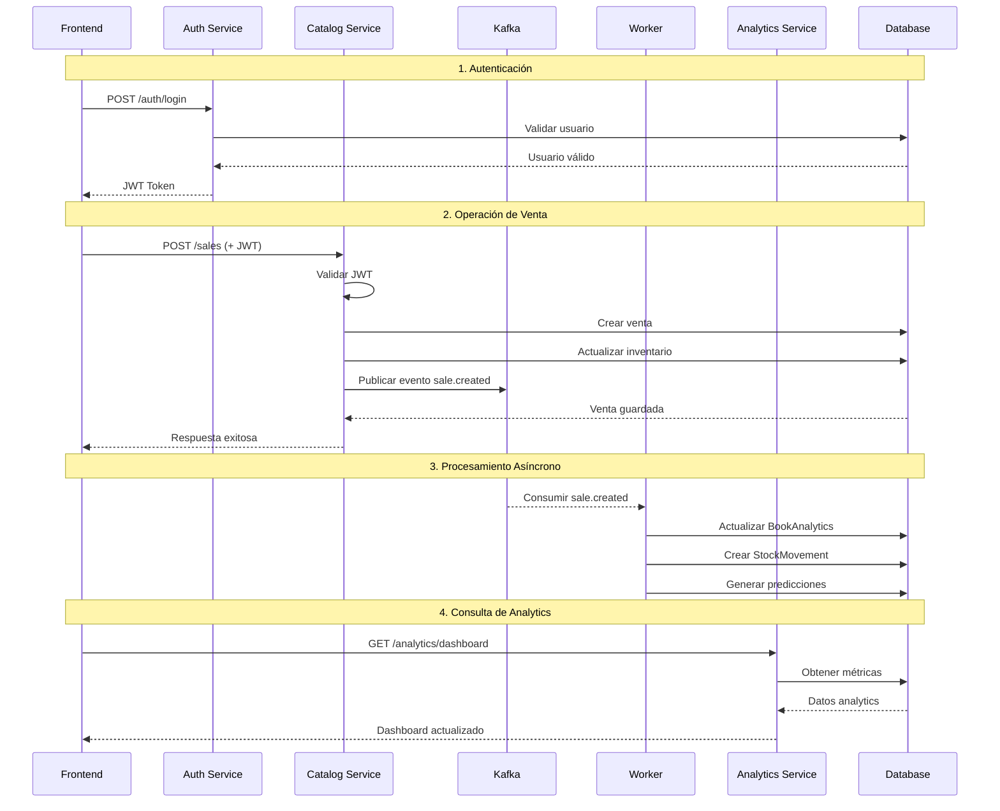
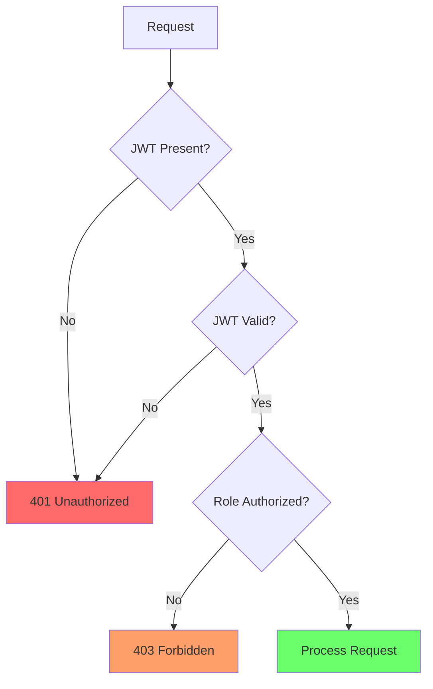
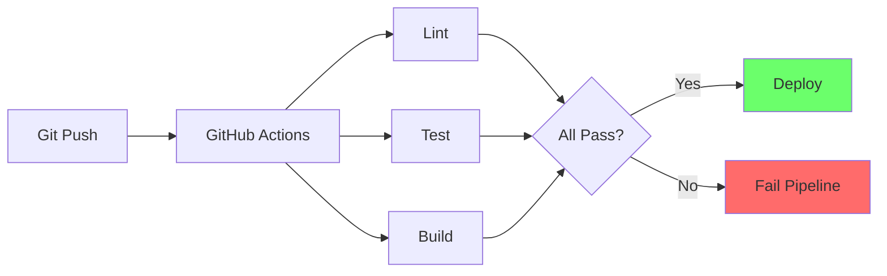

# Arquitectura del Sistema CMPC Test

## 📋 Descripción General

Sistema de microservicios para gestión de biblioteca con capacidades de analytics, predicción y reportería avanzada.

## 🏗️ Arquitectura de Microservicios



## 🔄 Flujo de Comunicación



## 🧩 Componentes del Sistema

### 1. Auth Service (Puerto 3001)
**Responsabilidades:**
- Autenticación de usuarios (registro/login)
- Generación de tokens JWT
- Gestión de roles (USER, ADMIN)
- CRUD de usuarios

**Stack Tecnológico:**
- NestJS
- TypeORM
- JWT
- bcrypt

### 2. Catalog Service (Puerto 3002)
**Responsabilidades:**
- Gestión de catálogo (libros, autores, géneros, editoriales)
- Sistema de ventas
- Gestión de inventario
- Publicación de eventos de negocio
- Auditoría de cambios

**Stack Tecnológico:**
- NestJS
- TypeORM
- KafkaJS
- Event-driven architecture

### 3. Analytics Service (Puerto 3003)
**Responsabilidades:**
- Dashboard de métricas en tiempo real
- Análisis de ventas
- Análisis predictivo con IA
- Reportes avanzados (ABC, rentabilidad, estacionalidad)
- Sistema de alertas automáticas
- Audit trail

**Stack Tecnológico:**
- NestJS
- TypeORM
- TensorFlow.js (predicciones)
- Cron Jobs (@nestjs/schedule)

### 4. Analytics Worker
**Responsabilidades:**
- Procesamiento asíncrono de eventos
- Actualización de analytics post-venta
- Generación de predicciones de demanda
- Cálculo de métricas de rotación
- Creación de movimientos de stock

**Stack Tecnológico:**
- NestJS
- KafkaJS
- TypeORM

### 5. Frontend (Angular)
**Responsabilidades:**
- Interfaz de usuario
- Gestión de autenticación
- Visualización de analytics
- Operaciones CRUD
- Generación de reportes

**Stack Tecnológico:**
- Angular 18
- RxJS
- HttpClient
- Guards y Interceptors

## 🗄️ Infraestructura

```mermaid
graph LR
    subgraph "Development Environment"
        DEV[Developer Machine]
    end
    
    subgraph "Container Orchestration"
        DC[Docker Compose]
    end
    
    subgraph "Containers"
        PG[PostgreSQL<br/>postgres:15-alpine]
        RP[Redpanda<br/>Kafka Compatible]
        RPConsole[Redpanda Console<br/>UI]
    end
    
    subgraph "Monorepo Build System"
        NX[Nx Workspace]
        JEST[Jest Testing]
    end
    
    DEV --> DC
    DC --> PG
    DC --> RP
    DC --> RPConsole
    DEV --> NX
    NX --> JEST
    
    style PG fill:#336791
    style RP fill:#ff6b6b
    style NX fill:#143055
    style JEST fill:#99425b
```



## 📊 Patrones de Arquitectura Implementados

### 1. Microservicios
Cada servicio es independiente y puede escalarse por separado.

### 2. Event-Driven Architecture
Uso de Kafka/Redpanda para comunicación asíncrona entre servicios.

### 3. CQRS (Command Query Responsibility Segregation)
- Catalog Service maneja commands (ventas, CRUD)
- Analytics Service maneja queries (reportes, métricas)

### 4. Repository Pattern
Uso de TypeORM repositories para abstracción de datos.

### 5. JWT Authentication
Autenticación stateless mediante tokens JWT.

### 6. Shared Kernel
Biblioteca compartida con entidades, DTOs y configuraciones comunes.

## 🔐 Seguridad



**Mecanismos implementados:**
- JWT con RS256 (claves RSA)
- Guards de autenticación
- Guards de roles (RBAC)
- Validación de tokens
- Hash de contraseñas con bcrypt
- Variables de entorno para secretos

## 📈 Escalabilidad

### Horizontal Scaling
- Cada microservicio puede replicarse
- Load balancing entre instancias
- Kafka permite múltiples consumers

### Vertical Scaling
- Optimización de queries con índices
- Paginación en endpoints
- Lazy loading en relaciones

### Caching Strategy
- Potencial para Redis (future)
- Cache de JWT validation
- Materialized views para analytics

## 🔄 CI/CD



**Pipeline actual:**
- Linting automático
- Tests unitarios (83 tests)
- Coverage > 90%
- Build validation
- Commitlint con Husky

## 🛠️ Tecnologías Core

| Categoría | Tecnología | Versión |
|-----------|-----------|---------|
| Framework | NestJS | 10.x |
| Frontend | Angular | 18.x |
| ORM | TypeORM | 0.3.x |
| Database | PostgreSQL | 15 |
| Message Broker | Redpanda | 23.3.x |
| Build System | Nx | 20.x |
| Testing | Jest | 29.x |
| Language | TypeScript | 5.x |

## 📝 Convenciones

### Conventional Commits
```
feat: nueva característica
fix: corrección de bug
docs: cambios en documentación
test: añadir o modificar tests
refactor: refactorización de código
```

### Estructura de Módulos
```
module/
├── dto/              # Data Transfer Objects
├── entities/        # TypeORM entities
├── module.ts        # Module definition
├── controller.ts    # REST endpoints
├── service.ts       # Business logic
└── *.spec.ts        # Unit tests
```

## 🎯 Objetivos de Calidad

- ✅ Coverage mínimo: 90%
- ✅ Tests unitarios obligatorios
- ✅ Validación de DTOs
- ✅ Tipado estricto TypeScript
- ✅ Documentación de APIs
- ✅ Code review requerido
