# Diagramas de Componentes y Deployment - Sistema CMPC Test

## 📋 Índice
1. [Diagrama de Componentes](#componentes)
2. [Diagrama de Deployment](#deployment)
3. [Diagrama de Paquetes](#paquetes)
4. [Diagrama de Clases (Entidades)](#clases)
5. [Diagrama de Estados](#estados)

## 🧩 Diagrama de Componentes {#componentes}

### Vista General del Sistema


### Detalle: Frontend Components


### Detalle: Catalog Service Components


## 🚀 Diagrama de Deployment {#deployment}

### Arquitectura de Deployment en Desarrollo


### Arquitectura de Deployment en Producción (Propuesta)


### Deployment con Docker Compose (Simplificado)


## 📦 Diagrama de Paquetes {#paquetes}

### Estructura de Monorepo


### Dependencias entre Paquetes

```mermaid
graph LR
    subgraph "External Dependencies"
        NESTJS[@nestjs/core<br/>@nestjs/common]
        TYPEORM[typeorm]
        ANGULAR[@angular/core]
        RXJS[rxjs]
        KAFKA[kafkajs]
        TENSORFLOW[@tensorflow/tfjs-node]
        JEST[jest]
    end
    
    subgraph "Internal Packages"
        SHARED[@cmpc-test/shared]
        UTILS[@cmpc-test/utils]
    end
    
    subgraph "Applications"
        AUTH[auth-service]
        CAT[catalog-service]
        ANA[analytics-service]
        WORKER[analytics-worker]
        FE[frontend]
    end
    
    AUTH --> NESTJS
    AUTH --> TYPEORM
    AUTH --> SHARED
    AUTH --> JEST
    
    CAT --> NESTJS
    CAT --> TYPEORM
    CAT --> SHARED
    CAT --> KAFKA
    CAT --> JEST
    
    ANA --> NESTJS
    ANA --> TYPEORM
    ANA --> SHARED
    ANA --> TENSORFLOW
    ANA --> JEST
    
    WORKER --> NESTJS
    WORKER --> TYPEORM
    WORKER --> SHARED
    WORKER --> KAFKA
    WORKER --> TENSORFLOW
    
    FE --> ANGULAR
    FE --> RXJS
    FE --> JEST
    
    SHARED --> TYPEORM
    SHARED --> NESTJS
    
    style SHARED fill:#fff4e1
    style NESTJS fill:#e1294f
    style ANGULAR fill:#dd0031
```

## 🎯 Diagrama de Clases - Entidades Principales {#clases}

### Módulo de Catálogo


### Módulo de Ventas


### Módulo de Analytics


## 🔄 Diagrama de Estados {#estados}

### Estado de una Venta


### Estado de una Alerta

```mermaid
stateDiagram-v2
    [*] --> Pending: Alerta creada
    
    Pending --> Active: Condiciones persisten
    Pending --> AutoResolved: Condiciones normalizadas
    
    Active --> Acknowledged: Admin visualiza
    Acknowledged --> InProgress: Admin toma acción
    
    InProgress --> Resolved: Acción completada
    InProgress --> Active: Acción fallida
    
    AutoResolved --> [*]
    Resolved --> [*]
    
    note right of Active
        Tipos de alerta:
        - LOW_STOCK
        - HIGH_DEMAND
        - LOW_ROTATION
        - RESTOCK_NEEDED
    end note
    
    note right of Resolved
        Resolución manual:
        - Timestamp de resolución
        - Usuario que resolvió
    end note
```



### Estado de Inventario de un Libro

```mermaid
stateDiagram-v2
    [*] --> Normal: Stock > minimum
    
    Normal --> LowStock: Stock <= minimum
    Normal --> Optimal: minimum < Stock <= maximum
    Normal --> Overstock: Stock > maximum
    
    LowStock --> CriticalLow: Stock <= minimum / 2
    LowStock --> Normal: Reabastecimiento
    
    CriticalLow --> OutOfStock: Stock = 0
    CriticalLow --> LowStock: Reabastecimiento parcial
    
    OutOfStock --> LowStock: Reabastecimiento
    
    Optimal --> Normal: Ventas
    Optimal --> Overstock: Reabastecimiento excesivo
    
    Overstock --> Optimal: Ajuste / Ventas
    
    note right of LowStock
        Trigger:
        - Generar alerta LOW_STOCK
        - Severity: HIGH
    end note
    
    note right of CriticalLow
        Trigger:
        - Generar alerta LOW_STOCK
        - Severity: CRITICAL
        - Notificar admin
    end note
    
    note right of OutOfStock
        Trigger:
        - Bloquear ventas
        - Alerta urgente
        - Predicción de demanda
    end note
```



### Estado de Procesamiento de Predicción


## 📊 Métricas y Monitoreo

### Health Checks

```mermaid
graph TB
    subgraph "Health Check Endpoints"
        HC[GET /health]
    end
    
    subgraph "Checks Realizados"
        DB_CHECK[Database<br/>Connection]
        KAFKA_CHECK[Kafka<br/>Connection]
        DISK_CHECK[Disk<br/>Space]
        MEMORY_CHECK[Memory<br/>Usage]
    end
    
    HC --> DB_CHECK
    HC --> KAFKA_CHECK
    HC --> DISK_CHECK
    HC --> MEMORY_CHECK
    
    DB_CHECK --> STATUS{All Healthy?}
    KAFKA_CHECK --> STATUS
    DISK_CHECK --> STATUS
    MEMORY_CHECK --> STATUS
    
    STATUS -->|Yes| HEALTHY[200 OK<br/>{status: 'up'}]
    STATUS -->|No| UNHEALTHY[503 Service Unavailable<br/>{status: 'down', details}]
    
    style HEALTHY fill:#6bff6b
    style UNHEALTHY fill:#ff6b6b
```

## 🎯 Conclusión

Esta documentación de componentes y deployment proporciona:

✅ **Vista de Componentes**: Arquitectura detallada de cada capa  
✅ **Deployment**: Estrategias para desarrollo y producción  
✅ **Paquetes**: Estructura de monorepo y dependencias  
✅ **Clases**: Modelo de dominio completo  
✅ **Estados**: Máquinas de estado de procesos críticos  

Útil para:
- Onboarding de nuevos desarrolladores
- Planificación de deployment
- Comprensión de flujos de estado
- Decisiones de arquitectura
