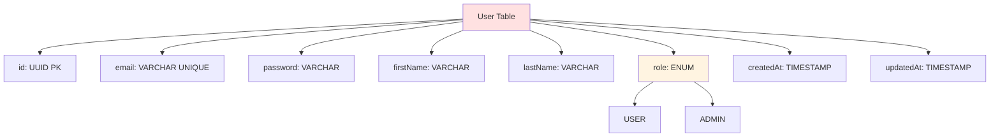
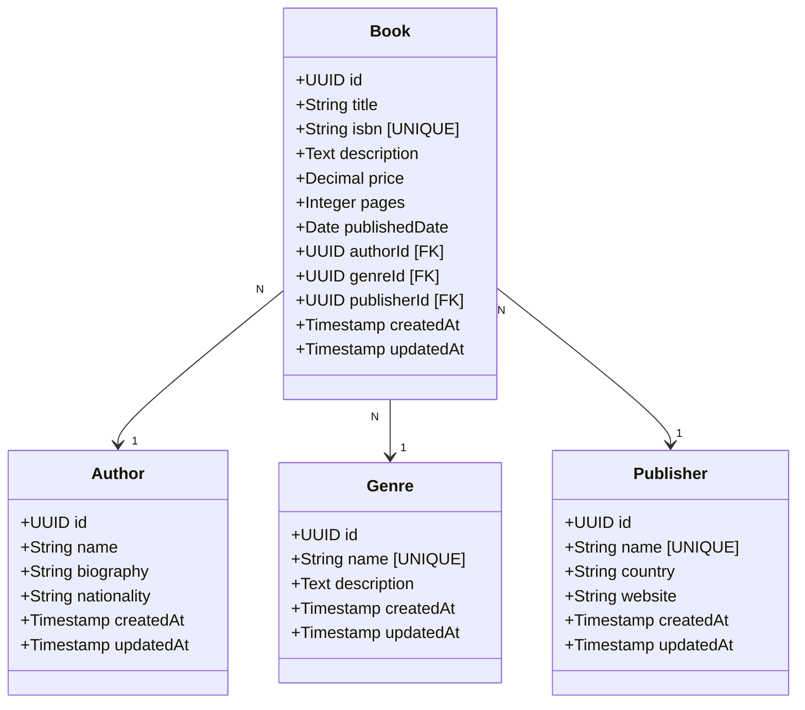
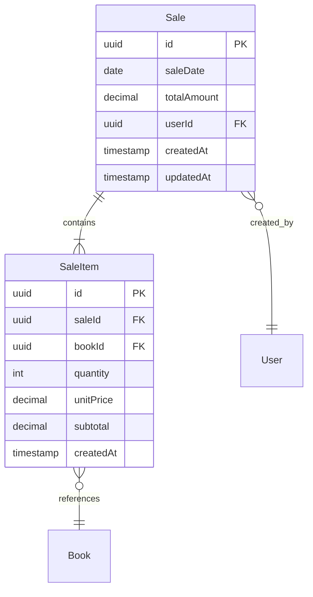
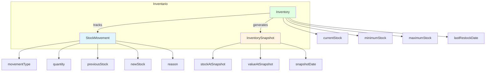
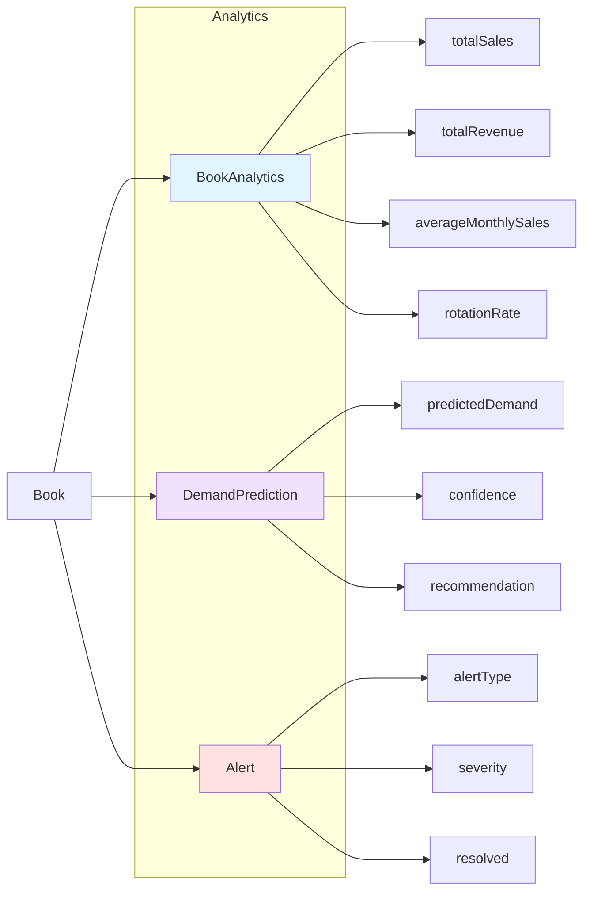
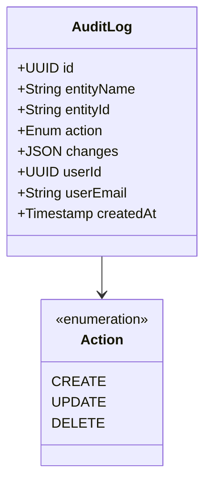
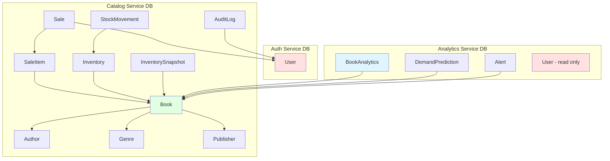
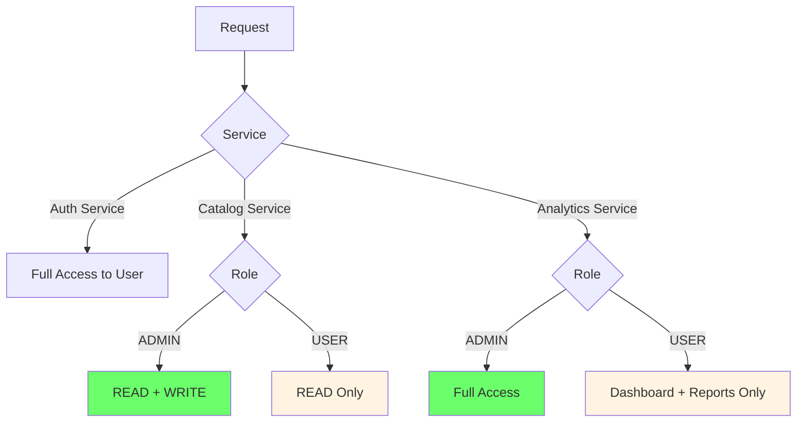

# Esquema de Base de Datos - Sistema CMPC Test

## 📋 Descripción General

Base de datos relacional PostgreSQL 15 que soporta el sistema de microservicios. Usa TypeORM como ORM.

## 🗃️ Diagrama Entidad-Relación Completo

```mermaid
erDiagram
    User ||--o{ Sale : "creates"
    User {
        uuid id PK
        string email UK
        string password
        string firstName
        string lastName
        enum role
        datetime createdAt
        datetime updatedAt
    }
    
    Book ||--o{ SaleItem : "sold_in"
    Book ||--|| BookAnalytics : "has"
    Book ||--|| Inventory : "has"
    Book }o--|| Author : "written_by"
    Book }o--|| Genre : "belongs_to"
    Book }o--|| Publisher : "published_by"
    Book {
        uuid id PK
        string title
        string isbn UK
        text description
        decimal price
        int pages
        date publishedDate
        uuid authorId FK
        uuid genreId FK
        uuid publisherId FK
        datetime createdAt
        datetime updatedAt
    }
    
    Author {
        uuid id PK
        string name
        string biography
        string nationality
        datetime createdAt
        datetime updatedAt
    }
    
    Genre {
        uuid id PK
        string name UK
        text description
        datetime createdAt
        datetime updatedAt
    }
    
    Publisher {
        uuid id PK
        string name UK
        string country
        string website
        datetime createdAt
        datetime updatedAt
    }
    
    Sale ||--|{ SaleItem : "contains"
    Sale {
        uuid id PK
        date saleDate
        decimal totalAmount
        uuid userId FK
        datetime createdAt
        datetime updatedAt
    }
    
    SaleItem {
        uuid id PK
        uuid saleId FK
        uuid bookId FK
        int quantity
        decimal unitPrice
        decimal subtotal
        datetime createdAt
    }
    
    Inventory ||--o{ StockMovement : "tracks"
    Inventory {
        uuid id PK
        uuid bookId FK UK
        int currentStock
        int minimumStock
        int maximumStock
        datetime lastRestockDate
        datetime createdAt
        datetime updatedAt
    }
    
    StockMovement {
        uuid id PK
        uuid inventoryId FK
        enum movementType
        int quantity
        int previousStock
        int newStock
        string reason
        uuid referenceId
        datetime createdAt
    }
    
    BookAnalytics {
        uuid id PK
        uuid bookId FK UK
        int totalSales
        decimal totalRevenue
        int averageMonthlySales
        decimal rotationRate
        datetime lastSaleDate
        datetime createdAt
        datetime updatedAt
    }
    
    Alert {
        uuid id PK
        uuid bookId FK
        enum alertType
        enum severity
        string message
        boolean resolved
        datetime resolvedAt
        datetime createdAt
        datetime updatedAt
    }
    
    Book ||--o{ Alert : "generates"
    
    AuditLog {
        uuid id PK
        string entityName
        string entityId
        enum action
        text changes
        uuid userId FK
        string userEmail
        datetime createdAt
    }
    
    User ||--o{ AuditLog : "performs"
    
    InventorySnapshot {
        uuid id PK
        uuid bookId FK
        int stockAtSnapshot
        decimal valueAtSnapshot
        date snapshotDate
        datetime createdAt
    }
    
    Book ||--o{ InventorySnapshot : "snapshots"
    
    DemandPrediction {
        uuid id PK
        uuid bookId FK
        int predictedDemand
        decimal confidence
        string recommendation
        date predictionDate
        datetime createdAt
    }
    
    Book ||--o{ DemandPrediction : "predicted_for"
```

## 📊 Módulos de Base de Datos

### 🔐 Módulo de Autenticación

#### Tabla: User



**Campos:**
- `id`: Identificador único (UUID v4)
- `email`: Email único, usado para login
- `password`: Contraseña hasheada con bcrypt
- `firstName`: Nombre del usuario
- `lastName`: Apellido del usuario
- `role`: Rol del usuario (USER | ADMIN)
- `createdAt`: Fecha de creación
- `updatedAt`: Fecha de última actualización

**Índices:**
- PRIMARY KEY: `id`
- UNIQUE KEY: `email`

**Validaciones:**
- Email: Formato válido
- Password: Mínimo 6 caracteres
- Role: Solo valores permitidos

### 📚 Módulo de Catálogo

#### Tabla: Book



**Relaciones:**
- `Book.authorId` → `Author.id` (Many-to-One)
- `Book.genreId` → `Genre.id` (Many-to-One)
- `Book.publisherId` → `Publisher.id` (Many-to-One)

**Índices:**
- PRIMARY KEY: `id`
- UNIQUE KEY: `isbn`
- INDEX: `authorId`
- INDEX: `genreId`
- INDEX: `publisherId`

#### Tabla: Author

**Campos:**
- `id`: UUID único
- `name`: Nombre del autor
- `biography`: Biografía
- `nationality`: Nacionalidad
- Timestamps

#### Tabla: Genre

**Campos:**
- `id`: UUID único
- `name`: Nombre único del género
- `description`: Descripción

#### Tabla: Publisher

**Campos:**
- `id`: UUID único
- `name`: Nombre único de la editorial
- `country`: País
- `website`: Sitio web

### 💰 Módulo de Ventas



#### Tabla: Sale

**Campos:**
- `id`: UUID único
- `saleDate`: Fecha de la venta
- `totalAmount`: Monto total (calculado)
- `userId`: Usuario que registró la venta
- Timestamps

**Índices:**
- PRIMARY KEY: `id`
- INDEX: `userId`
- INDEX: `saleDate`

#### Tabla: SaleItem

**Campos:**
- `id`: UUID único
- `saleId`: Referencia a la venta
- `bookId`: Referencia al libro
- `quantity`: Cantidad vendida
- `unitPrice`: Precio unitario al momento de la venta
- `subtotal`: Cantidad × Precio unitario
- `createdAt`: Timestamp

**Índices:**
- PRIMARY KEY: `id`
- INDEX: `saleId`
- INDEX: `bookId`

**Reglas de Negocio:**
- `subtotal = quantity * unitPrice`
- `Sale.totalAmount = SUM(SaleItem.subtotal)`
- Validación de stock antes de crear

### 📦 Módulo de Inventario



#### Tabla: Inventory

**Campos:**
- `id`: UUID único
- `bookId`: Referencia al libro (UNIQUE)
- `currentStock`: Stock actual
- `minimumStock`: Stock mínimo permitido
- `maximumStock`: Stock máximo recomendado
- `lastRestockDate`: Última fecha de reabastecimiento
- Timestamps

**Índices:**
- PRIMARY KEY: `id`
- UNIQUE KEY: `bookId`

**Relación:**
- One-to-One con Book

#### Tabla: StockMovement

**Campos:**
- `id`: UUID único
- `inventoryId`: Referencia al inventario
- `movementType`: Tipo de movimiento (ENUM)
  - `IN`: Entrada
  - `OUT`: Salida
  - `ADJUSTMENT`: Ajuste manual
- `quantity`: Cantidad del movimiento
- `previousStock`: Stock antes del movimiento
- `newStock`: Stock después del movimiento
- `reason`: Razón del movimiento
- `referenceId`: ID de referencia (ej: ID de venta)
- `createdAt`: Timestamp

**Índices:**
- PRIMARY KEY: `id`
- INDEX: `inventoryId`
- INDEX: `createdAt`

#### Tabla: InventorySnapshot

**Campos:**
- `id`: UUID único
- `bookId`: Referencia al libro
- `stockAtSnapshot`: Stock en el momento del snapshot
- `valueAtSnapshot`: Valor del inventario
- `snapshotDate`: Fecha del snapshot
- `createdAt`: Timestamp

**Propósito:** Histórico diario de inventario para análisis de tendencias

### 📊 Módulo de Analytics



#### Tabla: BookAnalytics

**Campos:**
- `id`: UUID único
- `bookId`: Referencia al libro (UNIQUE)
- `totalSales`: Total de unidades vendidas
- `totalRevenue`: Total de ingresos generados
- `averageMonthlySales`: Promedio de ventas mensuales
- `rotationRate`: Tasa de rotación del inventario
- `lastSaleDate`: Fecha de última venta
- Timestamps

**Relación:**
- One-to-One con Book

**Actualización:**
- Automática vía Analytics Worker al recibir eventos de venta

#### Tabla: DemandPrediction

**Campos:**
- `id`: UUID único
- `bookId`: Referencia al libro
- `predictedDemand`: Demanda predicha (unidades)
- `confidence`: Nivel de confianza (0-1)
- `recommendation`: Recomendación de acción
- `predictionDate`: Fecha de la predicción
- `createdAt`: Timestamp

**Índices:**
- PRIMARY KEY: `id`
- INDEX: `bookId, predictionDate`

**Generación:**
- Automática después de cada venta (Analytics Worker)
- Usa modelo TensorFlow.js

#### Tabla: Alert

**Campos:**
- `id`: UUID único
- `bookId`: Referencia al libro
- `alertType`: Tipo de alerta (ENUM)
  - `LOW_STOCK`: Stock bajo
  - `HIGH_DEMAND`: Alta demanda
  - `LOW_ROTATION`: Baja rotación
  - `RESTOCK_NEEDED`: Reabastecimiento necesario
- `severity`: Severidad (ENUM)
  - `LOW`: Bajo
  - `MEDIUM`: Medio
  - `HIGH`: Alto
  - `CRITICAL`: Crítico
- `message`: Mensaje de la alerta
- `resolved`: Si la alerta fue resuelta
- `resolvedAt`: Fecha de resolución
- Timestamps

**Índices:**
- PRIMARY KEY: `id`
- INDEX: `bookId`
- INDEX: `resolved, createdAt`

**Generación:**
- Automática vía Cron Jobs (cada hora o diaria)

### 📝 Módulo de Auditoría



#### Tabla: AuditLog

**Campos:**
- `id`: UUID único
- `entityName`: Nombre de la entidad modificada
- `entityId`: ID de la entidad
- `action`: Acción realizada (CREATE, UPDATE, DELETE)
- `changes`: Objeto JSON con cambios
  - Formato UPDATE: `{ field: { old: value, new: value } }`
  - Formato CREATE: `{ field: value }`
  - Formato DELETE: `{ field: value }`
- `userId`: Usuario que realizó la acción
- `userEmail`: Email del usuario (denormalizado)
- `createdAt`: Timestamp de la acción

**Índices:**
- PRIMARY KEY: `id`
- INDEX: `entityName, entityId`
- INDEX: `userId`
- INDEX: `createdAt`

**Implementación:**
- Via Interceptor en Catalog Service
- Captura automática de todas las modificaciones

## 🔗 Diagrama de Dependencias entre Servicios



## 📈 Estadísticas y Métricas

### Conteo de Tablas por Servicio

| Servicio | Tablas | Propósito |
|----------|--------|-----------|
| Auth Service | 1 | Usuarios y autenticación |
| Catalog Service | 9 | Catálogo, ventas, inventario |
| Analytics Service | 4 | Analytics, predicciones, alertas |
| **Total** | **14** | Sistema completo |

### Tipos de Relaciones

| Tipo | Cantidad | Ejemplos |
|------|----------|----------|
| One-to-One | 3 | Book-BookAnalytics, Book-Inventory |
| One-to-Many | 8 | Book-SaleItem, Sale-SaleItem |
| Many-to-One | 8 | Book-Author, Book-Genre |

## 🔐 Seguridad y Permisos

### Políticas de Acceso



### Encriptación

- **Passwords**: bcrypt con salt rounds = 10
- **JWT**: RS256 (RSA con SHA-256)
- **Database**: TLS en producción (recomendado)

## 🎯 Optimizaciones Implementadas

### Índices

```sql
-- Índices de búsqueda frecuente
CREATE INDEX idx_book_author ON book(authorId);
CREATE INDEX idx_book_genre ON book(genreId);
CREATE INDEX idx_book_publisher ON book(publisherId);
CREATE INDEX idx_sale_date ON sale(saleDate);
CREATE INDEX idx_alert_resolved ON alert(resolved, createdAt);

-- Índices únicos
CREATE UNIQUE INDEX idx_user_email ON user(email);
CREATE UNIQUE INDEX idx_book_isbn ON book(isbn);
CREATE UNIQUE INDEX idx_inventory_book ON inventory(bookId);
```

### Constraints

```sql
-- Check constraints
ALTER TABLE inventory ADD CONSTRAINT chk_current_stock_positive 
    CHECK (currentStock >= 0);

ALTER TABLE sale ADD CONSTRAINT chk_total_amount_positive 
    CHECK (totalAmount >= 0);

ALTER TABLE sale_item ADD CONSTRAINT chk_quantity_positive 
    CHECK (quantity > 0);

-- FK constraints con ON DELETE
ALTER TABLE book ADD CONSTRAINT fk_book_author 
    FOREIGN KEY (authorId) REFERENCES author(id) ON DELETE CASCADE;
```

### Particionamiento (Future)

**Candidatos para particionamiento:**
- `audit_log` por fecha (partición mensual)
- `stock_movement` por fecha (partición mensual)
- `inventory_snapshot` por fecha (partición anual)

## 📊 Queries Comunes Optimizadas

### Top 10 Libros Más Vendidos

```sql
SELECT 
    b.id,
    b.title,
    ba.totalSales,
    ba.totalRevenue
FROM book b
INNER JOIN book_analytics ba ON b.id = ba.bookId
ORDER BY ba.totalSales DESC
LIMIT 10;
```

### Inventario con Stock Bajo

```sql
SELECT 
    b.id,
    b.title,
    i.currentStock,
    i.minimumStock
FROM book b
INNER JOIN inventory i ON b.id = i.bookId
WHERE i.currentStock <= i.minimumStock;
```

### Ventas del Mes Actual

```sql
SELECT 
    DATE(s.saleDate) as date,
    SUM(s.totalAmount) as dailyRevenue,
    COUNT(s.id) as dailySales
FROM sale s
WHERE s.saleDate >= DATE_TRUNC('month', CURRENT_DATE)
GROUP BY DATE(s.saleDate)
ORDER BY DATE(s.saleDate);
```

## 🔄 Migraciones

### Estrategia de Migraciones

- **TypeORM Migrations**: Automáticas en desarrollo
- **Version Control**: Todas las migraciones en Git
- **Rollback**: Siempre implementar `down` migrations
- **Testing**: Probar migraciones en staging antes de producción

### Ejemplo de Migración

```typescript
export class AddBookAnalytics1234567890 implements MigrationInterface {
    async up(queryRunner: QueryRunner): Promise<void> {
        await queryRunner.createTable(new Table({
            name: 'book_analytics',
            columns: [
                { name: 'id', type: 'uuid', isPrimary: true },
                { name: 'bookId', type: 'uuid', isUnique: true },
                { name: 'totalSales', type: 'int', default: 0 },
                // ... more columns
            ],
        }));
    }
    
    async down(queryRunner: QueryRunner): Promise<void> {
        await queryRunner.dropTable('book_analytics');
    }
}
```

## 🎯 Mejores Prácticas Implementadas

✅ UUIDs en lugar de auto-increment IDs (seguridad, distributed systems)
✅ Timestamps automáticos (createdAt, updatedAt)
✅ Soft deletes donde aplica (datos históricos)
✅ Normalización apropiada (3NF)
✅ Denormalización estratégica (analytics)
✅ Índices en foreign keys
✅ Constraints de integridad
✅ Transacciones ACID para ventas
✅ Audit logging completo
