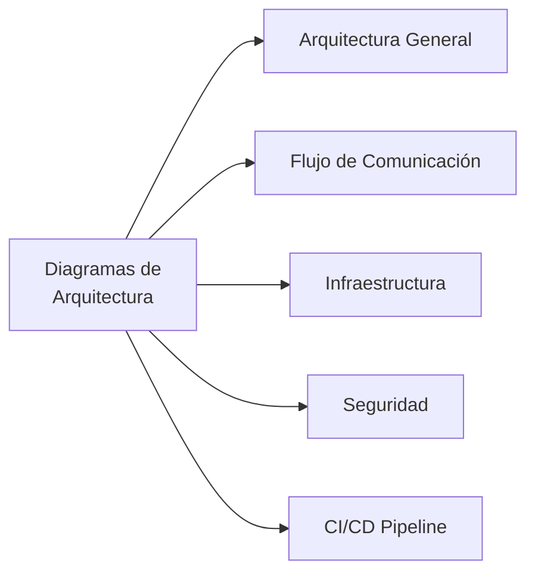
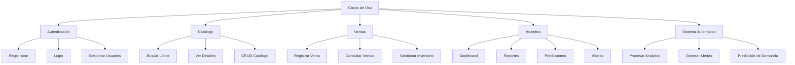
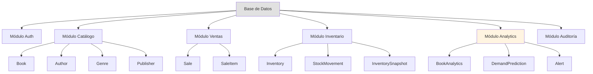
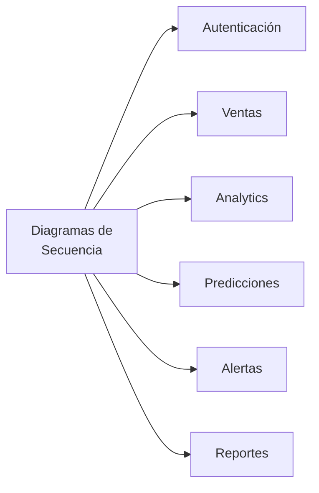
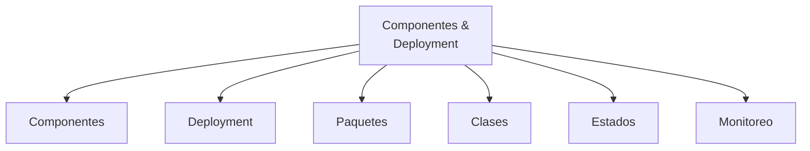

# 📚 Índice de Documentación - Sistema CMPC Test

Documentación técnica completa del sistema de microservicios para gestión de biblioteca con analytics y predicciones.

---

## 📋 Documentos Disponibles

### 1. [ARCHITECTURE.md](ARCHITECTURE.md) - Arquitectura del Sistema
**Descripción:** Arquitectura completa del sistema de microservicios.

**Contenido:**
- 🏗️ Arquitectura de microservicios
- 🔄 Flujos de comunicación entre servicios
- 🧩 Componentes del sistema (Auth, Catalog, Analytics, Worker)
- 🗄️ Infraestructura y contenedores
- 📊 Patrones de arquitectura implementados
- 🔐 Mecanismos de seguridad
- 📈 Estrategias de escalabilidad
- 🔄 Pipeline de CI/CD
- 🛠️ Stack tecnológico

**Diagramas incluidos:**


**Para quién:**
- Arquitectos de software
- Tech leads
- Nuevos desarrolladores (onboarding)

---

### 2. [USE_CASES.md](USE_CASES.md) - Casos de Uso
**Descripción:** Documentación completa de todos los casos de uso del sistema.

**Contenido:**
- 📊 Diagrama general de casos de uso
- 🔐 Casos de uso de autenticación (Login, Registro, Gestión de usuarios)
- 📚 Casos de uso de catálogo (Búsqueda, Gestión de libros, autores, géneros)
- 💰 Casos de uso de ventas (Registro, Consulta, Inventario)
- 📊 Casos de uso de analytics (Dashboard, Reportes, Predicciones, Alertas)
- 🤖 Casos de uso automáticos del sistema (Workers, Cron jobs)
- 📝 Resumen de actores y permisos

**Diagramas incluidos:**


**Para quién:**
- Product managers
- QA testers
- Business analysts
- Desarrolladores

---

### 3. [DATABASE_SCHEMA.md](DATABASE_SCHEMA.md) - Esquema de Base de Datos
**Descripción:** Documentación completa del modelo de datos y esquema de base de datos.

**Contenido:**
- 🗃️ Diagrama Entidad-Relación completo
- 📊 Módulos de base de datos:
  - 🔐 Autenticación (User)
  - 📚 Catálogo (Book, Author, Genre, Publisher)
  - 💰 Ventas (Sale, SaleItem)
  - 📦 Inventario (Inventory, StockMovement, InventorySnapshot)
  - 📊 Analytics (BookAnalytics, DemandPrediction, Alert)
  - 📝 Auditoría (AuditLog)
- 🔗 Relaciones entre entidades
- 🔐 Seguridad y permisos
- 🎯 Optimizaciones (índices, constraints)
- 📊 Queries comunes optimizadas
- 🔄 Estrategia de migraciones

**Estadísticas:**
- 📊 14 tablas en total
- 🔗 11 relaciones definidas
- 🎯 25+ índices optimizados

**Diagramas incluidos:**


**Para quién:**
- Database administrators
- Backend developers
- Data analysts

---

### 4. [SEQUENCE_DIAGRAMS.md](SEQUENCE_DIAGRAMS.md) - Diagramas de Secuencia
**Descripción:** Flujos detallados de interacción entre componentes del sistema.

**Contenido:**
- 🔐 Flujos de autenticación:
  - Login de usuario
  - Validación de token
  - Registro de usuario
- 💰 Procesos de venta:
  - Registro completo de venta (síncrono + asíncrono)
  - Verificación de stock
  - Actualización de inventario
- 📊 Flujos de analytics:
  - Consulta de dashboard
  - Análisis de ventas con filtros
  - Métricas en tiempo real
- 🔮 Generación de predicciones:
  - Procesamiento con TensorFlow.js
  - Cálculo de confianza
  - Recomendaciones de reabastecimiento
- 🚨 Sistema de alertas:
  - Generación automática con cron jobs
  - Consulta y gestión de alertas
  - Tipos de alertas (stock bajo, alta demanda, baja rotación)
- 📄 Generación de reportes:
  - Análisis ABC (Pareto)
  - Estacionalidad
  - Audit trail

**Diagramas incluidos:**


**Para quién:**
- Desarrolladores backend
- Arquitectos de soluciones
- QA automation engineers

---

### 5. [COMPONENTS_DEPLOYMENT.md](COMPONENTS_DEPLOYMENT.md) - Componentes y Deployment
**Descripción:** Arquitectura de componentes, deployment y estados del sistema.

**Contenido:**
- 🧩 Diagramas de componentes:
  - Vista general del sistema
  - Frontend components (Angular)
  - Backend services (NestJS)
  - Detalle por servicio
- 🚀 Diagramas de deployment:
  - Arquitectura en desarrollo
  - Arquitectura en producción (Kubernetes)
  - Docker Compose
- 📦 Estructura de paquetes:
  - Monorepo estructura (Nx)
  - Dependencias entre paquetes
  - Shared libraries
- 🎯 Diagramas de clases:
  - Entidades principales
  - Módulo de catálogo
  - Módulo de ventas
  - Módulo de analytics
- 🔄 Diagramas de estados:
  - Estado de una venta
  - Estado de alertas
  - Estado de inventario
  - Procesamiento de predicciones
- 📊 Métricas y monitoreo (Health checks)

**Diagramas incluidos:**


**Para quién:**
- DevOps engineers
- System administrators
- Full-stack developers

---

### 6. Documentación Existente (Legacy)

#### [MIGRATION_ANALYTICS_SERVICE.md](MIGRATION_ANALYTICS_SERVICE.md)
Guía de migración del servicio de analytics.

#### [KAFKA_SALES_IMPLEMENTATION.md](KAFKA_SALES_IMPLEMENTATION.md)
Implementación de eventos de Kafka para ventas.

#### [USER_REGISTRATION_FLOW.md](USER_REGISTRATION_FLOW.md)
Flujo de registro de usuarios.

#### [WINSTON_LOGGER.md](WINSTON_LOGGER.md), [WINSTON_EXAMPLES.md](WINSTON_EXAMPLES.md), [MIGRATION_WINSTON.md](MIGRATION_WINSTON.md)
Documentación del sistema de logging con Winston.

#### [HUSKY_COMMITLINT.md](HUSKY_COMMITLINT.md)
Configuración de Husky y Commitlint.

#### [ANALYTICS_API_DOCUMENTATION.md](ANALYTICS_API_DOCUMENTATION.md)
Documentación de la API de Analytics.

#### [EVENT_EMITTER_CLEANUP.md](EVENT_EMITTER_CLEANUP.md)
Limpieza de event emitters.

---

## 🗺️ Mapa de Navegación Recomendado

### Para Nuevos Desarrolladores
```
1. ARCHITECTURE.md (Visión general)
   ↓
2. USE_CASES.md (Entender funcionalidades)
   ↓
3. DATABASE_SCHEMA.md (Modelo de datos)
   ↓
4. SEQUENCE_DIAGRAMS.md (Flujos de negocio)
   ↓
5. COMPONENTS_DEPLOYMENT.md (Detalles técnicos)
```

### Para Arquitectos / Tech Leads
```
1. ARCHITECTURE.md (Decisiones de arquitectura)
   ↓
2. COMPONENTS_DEPLOYMENT.md (Deployment strategies)
   ↓
3. DATABASE_SCHEMA.md (Optimizaciones de datos)
```

### Para Product Managers / QA
```
1. USE_CASES.md (Casos de uso completos)
   ↓
2. SEQUENCE_DIAGRAMS.md (Flujos funcionales)
   ↓
3. ARCHITECTURE.md (Limitaciones técnicas)
```

### Para DevOps
```
1. COMPONENTS_DEPLOYMENT.md (Deployment completo)
   ↓
2. ARCHITECTURE.md (Infraestructura)
   ↓
3. DATABASE_SCHEMA.md (Requisitos de BD)
```

---

## 🔍 Búsqueda Rápida por Tema

### 🔐 Seguridad
- [ARCHITECTURE.md](ARCHITECTURE.md#seguridad) - Mecanismos de seguridad
- [SEQUENCE_DIAGRAMS.md](SEQUENCE_DIAGRAMS.md#autenticación) - Flujos JWT
- [DATABASE_SCHEMA.md](DATABASE_SCHEMA.md#seguridad) - Políticas de acceso

### 📊 Analytics & Reportes
- [USE_CASES.md](USE_CASES.md#analytics) - Casos de uso de analytics
- [SEQUENCE_DIAGRAMS.md](SEQUENCE_DIAGRAMS.md#analytics-tiempo-real) - Flujos de analytics
- [SEQUENCE_DIAGRAMS.md](SEQUENCE_DIAGRAMS.md#reportes) - Generación de reportes
- [DATABASE_SCHEMA.md](DATABASE_SCHEMA.md) - Tablas de analytics

### 🔮 Predicciones con IA
- [SEQUENCE_DIAGRAMS.md](SEQUENCE_DIAGRAMS.md#predicciones) - Generación de predicciones
- [COMPONENTS_DEPLOYMENT.md](COMPONENTS_DEPLOYMENT.md#estados) - Estado de predicciones
- [ARCHITECTURE.md](ARCHITECTURE.md) - TensorFlow.js

### 🚨 Sistema de Alertas
- [USE_CASES.md](USE_CASES.md#administrativos) - Alertas automáticas
- [SEQUENCE_DIAGRAMS.md](SEQUENCE_DIAGRAMS.md#alertas-automáticas) - Flujo de alertas
- [COMPONENTS_DEPLOYMENT.md](COMPONENTS_DEPLOYMENT.md#estados) - Estados de alertas

### 💰 Ventas e Inventario
- [USE_CASES.md](USE_CASES.md#ventas) - Casos de uso de ventas
- [SEQUENCE_DIAGRAMS.md](SEQUENCE_DIAGRAMS.md#registro-venta) - Proceso de venta
- [DATABASE_SCHEMA.md](DATABASE_SCHEMA.md) - Tablas de ventas e inventario

### 📦 Kafka / Event-Driven
- [ARCHITECTURE.md](ARCHITECTURE.md#arquitectura-de-microservicios) - Event-driven architecture
- [SEQUENCE_DIAGRAMS.md](SEQUENCE_DIAGRAMS.md#registro-venta) - Publicación de eventos
- [KAFKA_SALES_IMPLEMENTATION.md](KAFKA_SALES_IMPLEMENTATION.md) - Implementación Kafka

### 🚀 Deployment
- [COMPONENTS_DEPLOYMENT.md](COMPONENTS_DEPLOYMENT.md#deployment) - Estrategias de deployment
- [ARCHITECTURE.md](ARCHITECTURE.md#infraestructura) - Infraestructura

---

## 📈 Métricas de Documentación

| Documento | Páginas | Diagramas | Estado |
|-----------|---------|-----------|--------|
| ARCHITECTURE.md | ~10 | 5 | ✅ Completo |
| USE_CASES.md | ~15 | 15+ | ✅ Completo |
| DATABASE_SCHEMA.md | ~12 | 8 | ✅ Completo |
| SEQUENCE_DIAGRAMS.md | ~10 | 10 | ✅ Completo |
| COMPONENTS_DEPLOYMENT.md | ~12 | 12 | ✅ Completo |
| **TOTAL** | **~60** | **50+** | **100%** |

---

## 🛠️ Herramientas para Ver Diagramas

Todos los diagramas están en formato **Mermaid**, compatible con:

- ✅ **GitHub / GitLab** - Renderizado automático
- ✅ **VS Code** - Extensión "Markdown Preview Mermaid Support"
- ✅ **IntelliJ IDEA** - Plugin Mermaid
- ✅ **Confluence** - Apps de Mermaid
- ✅ **Navegador** - [Mermaid Live Editor](https://mermaid.live/)

---

## 📝 Convenciones de Documentación

### Formato de Diagramas
- Todos en **Mermaid.js**
- Colores consistentes por tipo de servicio
- Leyendas y notas incluidas

### Estructura de Archivos
- Encabezados con emojis para mejor navegación
- Índice al inicio de cada documento
- Enlaces internos entre documentos
- Código de ejemplo cuando aplica

### Actualización
- Documentación vive en el código (docs/)
- Pull requests requieren actualización de docs si hay cambios de arquitectura
- Revisión de docs en code reviews

---

## 🎯 Próximos Pasos

### Para Desarrolladores Nuevos
1. Leer [ARCHITECTURE.md](ARCHITECTURE.md)
2. Revisar [USE_CASES.md](USE_CASES.md)
3. Clonar repositorio y ejecutar setup
4. Leer [DATABASE_SCHEMA.md](DATABASE_SCHEMA.md)
5. Empezar a codificar 🚀

### Para Profundizar
1. Estudiar [SEQUENCE_DIAGRAMS.md](SEQUENCE_DIAGRAMS.md) para flujos complejos
2. Revisar [COMPONENTS_DEPLOYMENT.md](COMPONENTS_DEPLOYMENT.md) para deployment
3. Explorar código fuente
4. Contribuir a la documentación

---

## 📞 Contacto y Contribuciones

¿Encontraste algún error o tienes sugerencias?
- Abre un issue en GitHub
- Crea un PR con mejoras
- Contacta al equipo de arquitectura

---

**Última actualización:** Febrero 2026  
**Versión:** 1.0.0  
**Mantenido por:** Equipo de Desarrollo CMPC Test
