# Diagramas de Secuencia - Sistema CMPC Test

## 📋 Índice
1. [Flujo de Autenticación](#autenticación)
2. [Flujo de Registro de Venta](#registro-venta)
3. [Flujo de Analytics en Tiempo Real](#analytics-tiempo-real)
4. [Flujo de Predicciones](#predicciones)
5. [Flujo de Alertas Automáticas](#alertas-automáticas)
6. [Flujo de Generación de Reportes](#reportes)

## 🔐 Flujo de Autenticación {#autenticación}

### Login de Usuario

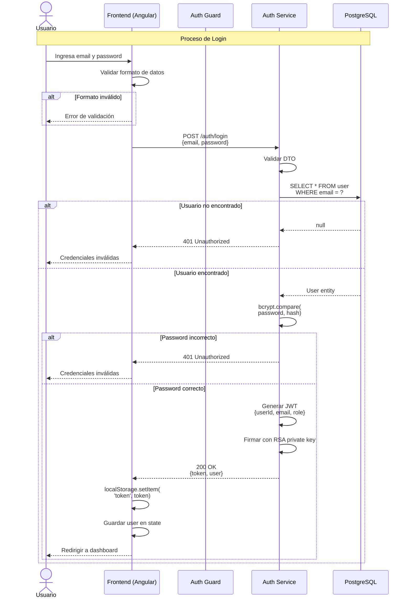

### Validación de Token en Request

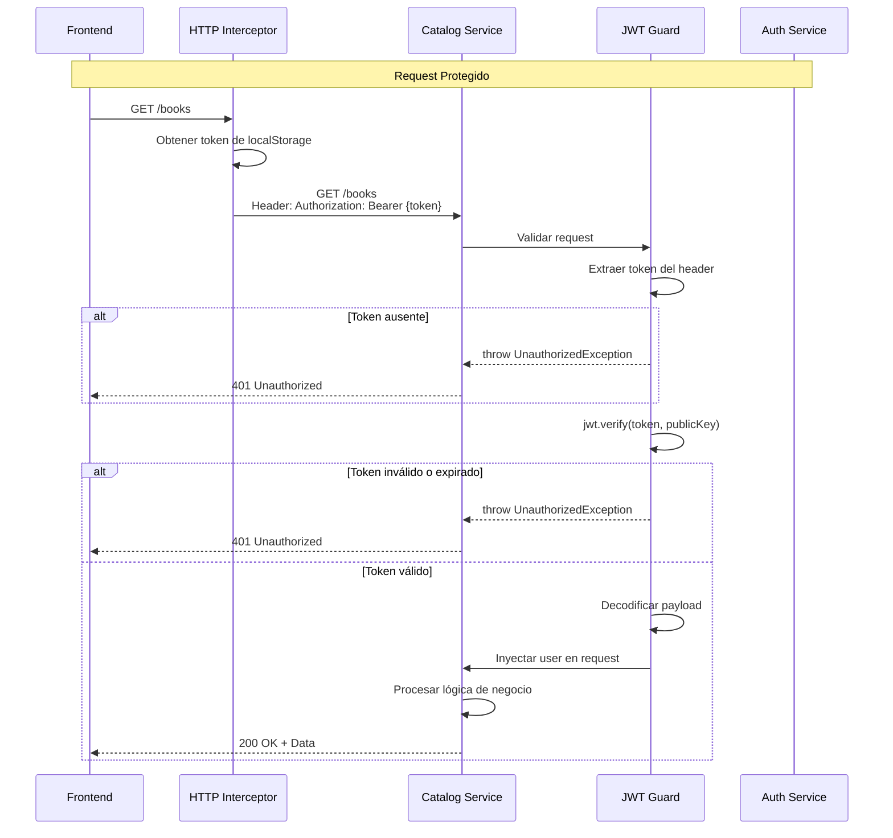

### Registro de Nuevo Usuario

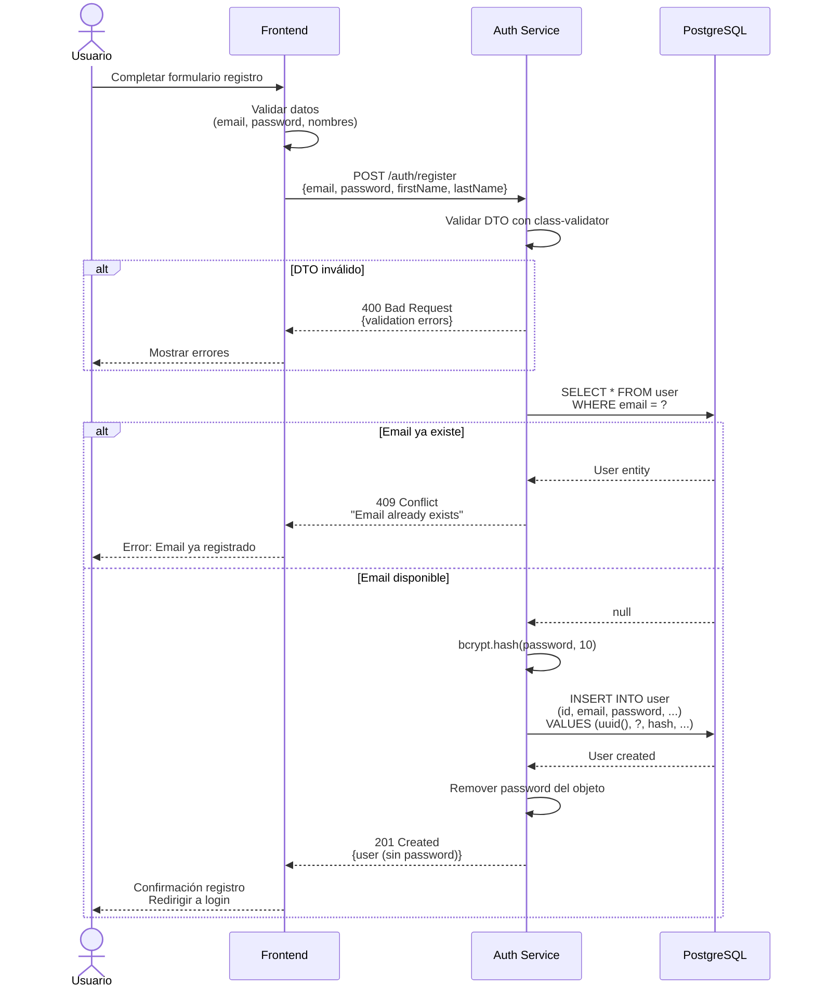

## 💰 Flujo de Registro de Venta {#registro-venta}

### Proceso Completo de Venta (Síncrono + Asíncrono)

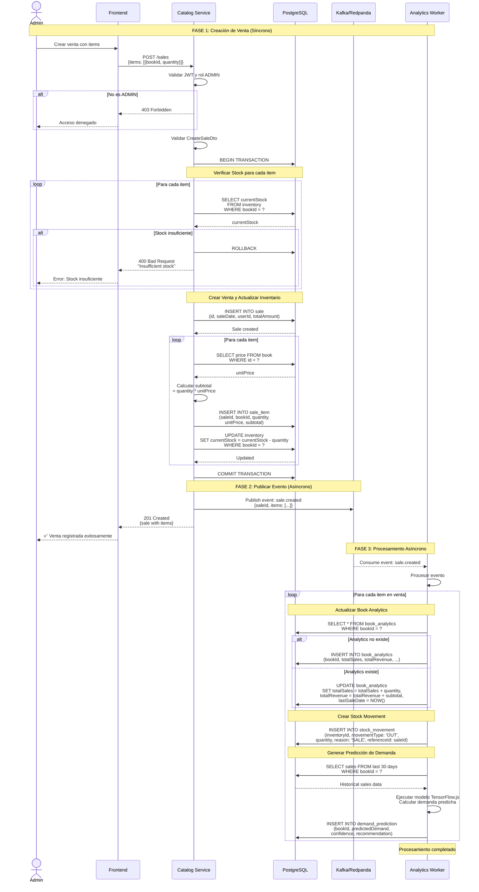

### Verificación de Stock Antes de Venta

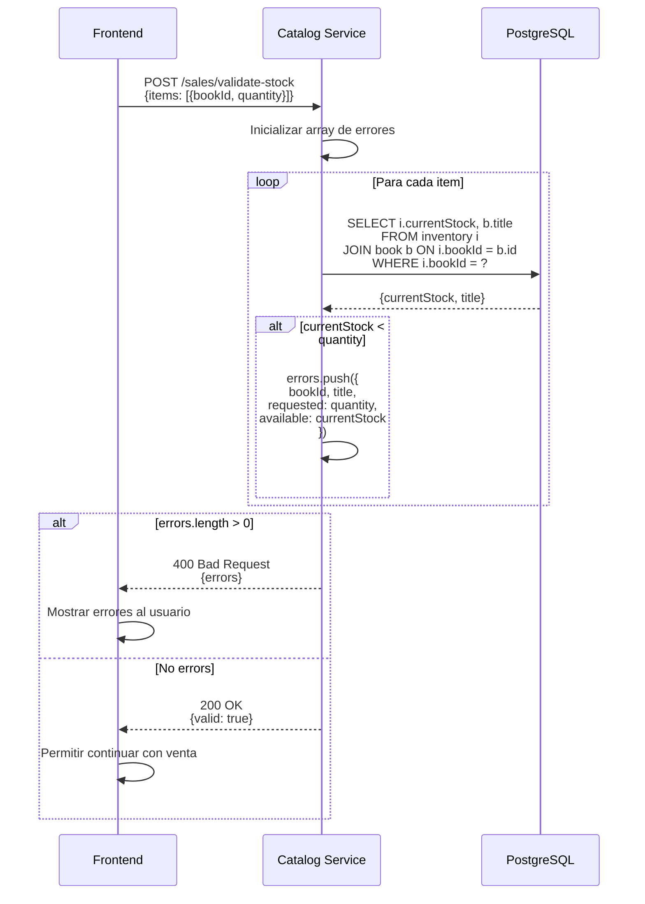

## 📊 Flujo de Analytics en Tiempo Real {#analytics-tiempo-real}

### Consulta de Dashboard

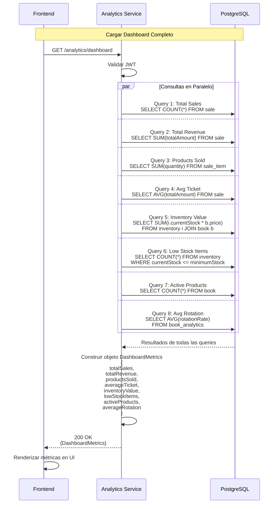

### Análisis de Ventas con Filtros

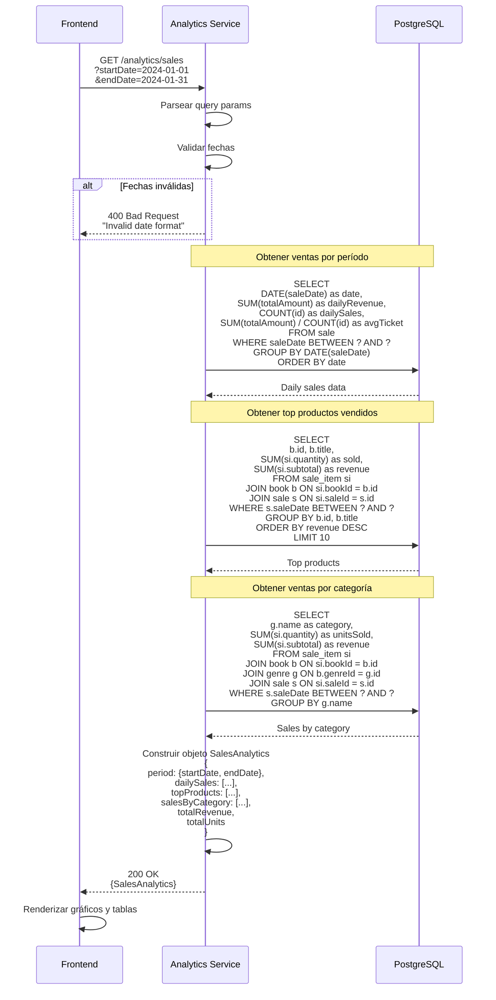

## 🔮 Flujo de Predicciones {#predicciones}

### Generación de Predicción de Demanda

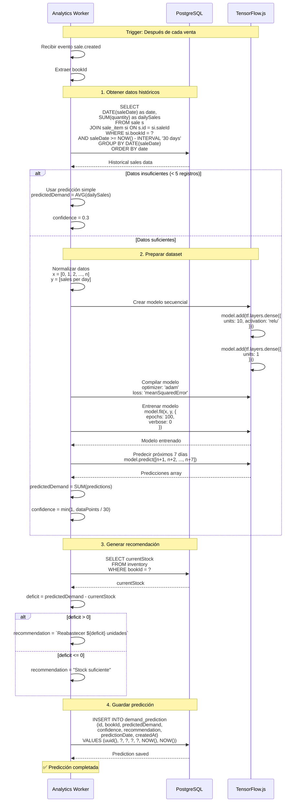

### Consulta de Predicciones

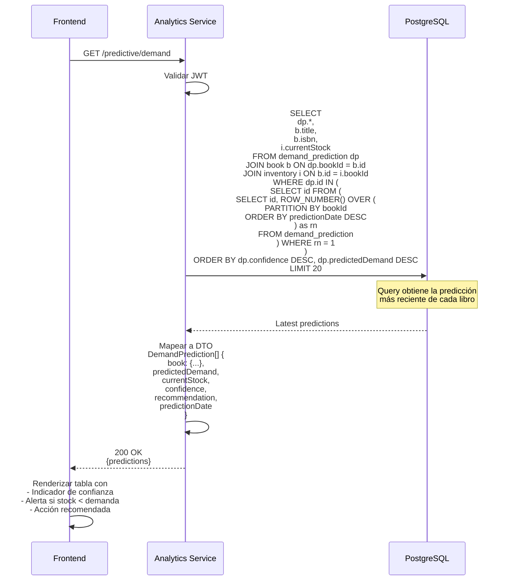

## 🚨 Flujo de Alertas Automáticas {#alertas-automáticas}

### Generación Automática de Alertas (Cron Job)

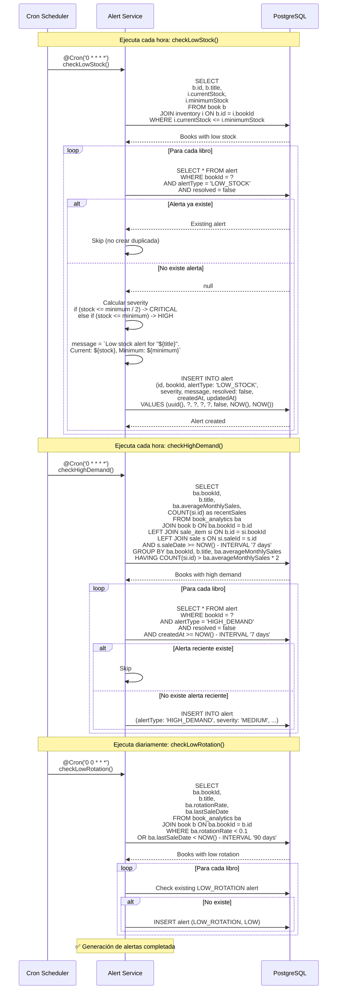

### Consulta y Gestión de Alertas

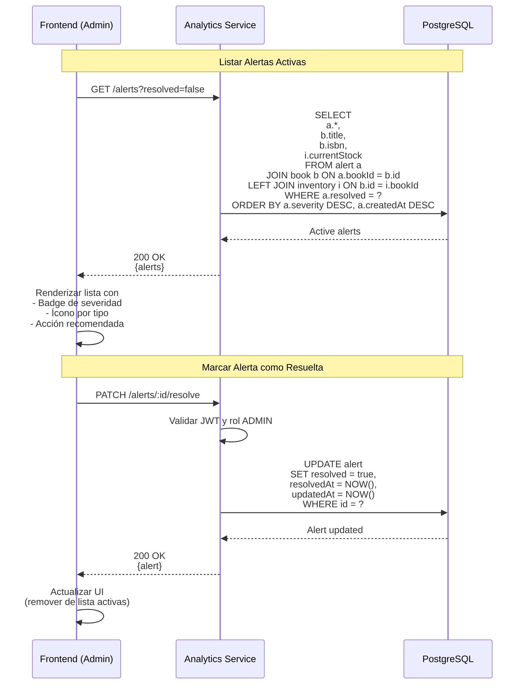

## 📄 Flujo de Generación de Reportes {#reportes}

### Reporte de Análisis ABC (Pareto)

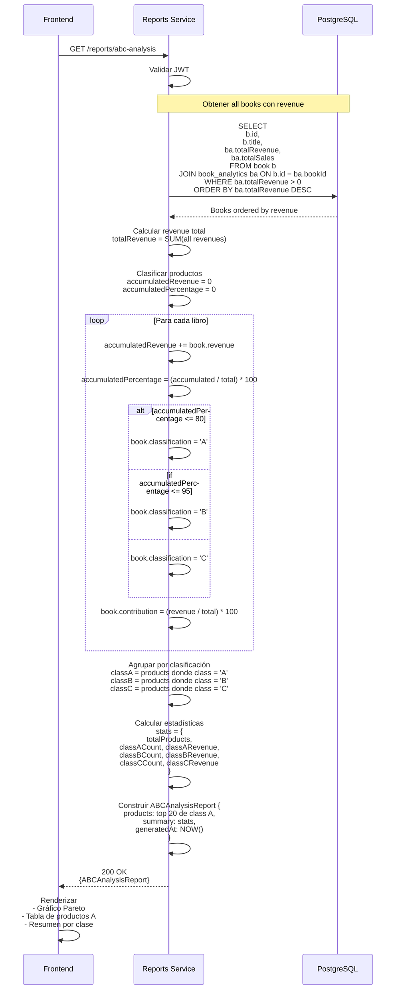

### Reporte de Estacionalidad

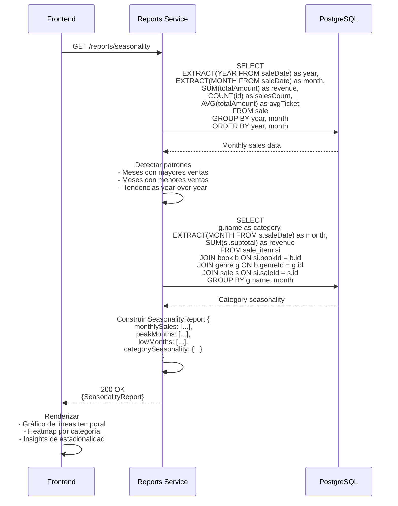

### Audit Trail (Trazabilidad)

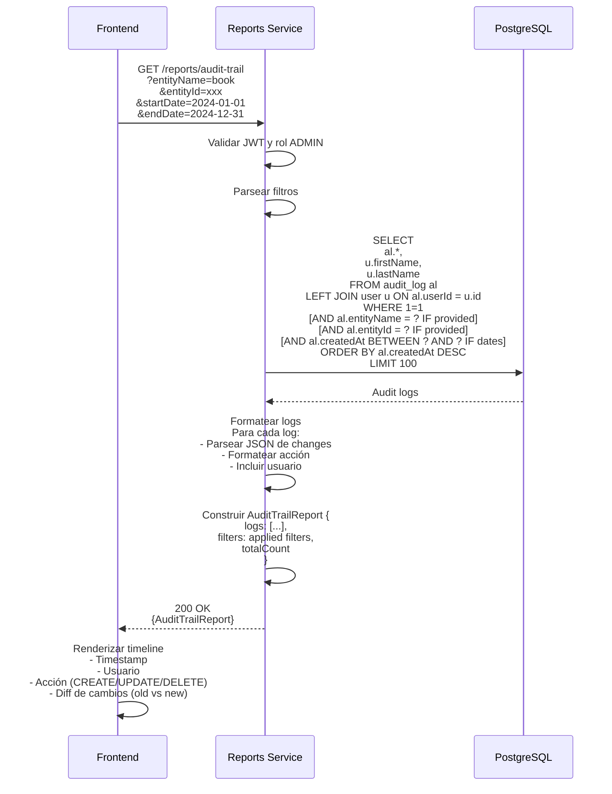

## 🏁 Conclusión

Estos diagramas de secuencia documentan los flujos principales del sistema CMPC Test, mostrando:

✅ **Flujos síncronos**: Login, ventas, consultas  
✅ **Flujos asíncronos**: Analytics worker, predicciones  
✅ **Flujos automatizados**: Alertas con cron jobs  
✅ **Flujos de reporting**: Generación de reportes complejos  

Cada flujo incluye:
- Participantes involucrados
- Validaciones de seguridad (JWT, roles)
- Interacciones con base de datos
- Manejo de errores y casos alternativos
- Transformación de datos
