# Casos de Uso - Sistema CMPC Test

## 📋 Índice
1. [Diagrama General de Casos de Uso](#diagrama-general)
2. [Casos de Uso de Autenticación](#autenticación)
3. [Casos de Uso de Catálogo](#catálogo)
4. [Casos de Uso de Ventas](#ventas)
5. [Casos de Uso de Analytics](#analytics)
6. [Casos de Uso Administrativos](#administrativos)

## Diagrama General de Casos de Uso {#diagrama-general}

```mermaid
graph TB
    subgraph "Actores"
        USER[👤 Usuario]
        ADMIN[👨‍💼 Administrador]
        SYSTEM[🤖 Sistema]
    end
    
    subgraph "Auth Service"
        UC1[Registrarse]
        UC2[Iniciar Sesión]
        UC3[Gestionar Usuarios]
    end
    
    subgraph "Catalog Service"
        UC4[Buscar Libros]
        UC5[Ver Detalles Libro]
        UC6[Gestionar Catálogo]
        UC7[Gestionar Autores]
        UC8[Gestionar Géneros]
        UC9[Gestionar Editoriales]
    end
    
    subgraph "Sales Service"
        UC10[Registrar Venta]
        UC11[Consultar Ventas]
        UC12[Gestionar Inventario]
    end
    
    subgraph "Analytics Service"
        UC13[Ver Dashboard]
        UC14[Consultar Reportes]
        UC15[Ver Predicciones]
        UC16[Gestionar Alertas]
    end
    
    subgraph "Background Processing"
        UC17[Procesar Analytics]
        UC18[Generar Alertas Automáticas]
        UC19[Actualizar Predicciones]
    end
    
    USER --> UC1
    USER --> UC2
    USER --> UC4
    USER --> UC5
    USER --> UC10
    USER --> UC11
    USER --> UC13
    USER --> UC14
    USER --> UC15
    
    ADMIN --> UC3
    ADMIN --> UC6
    ADMIN --> UC7
    ADMIN --> UC8
    ADMIN --> UC9
    ADMIN --> UC12
    ADMIN --> UC16
    
    SYSTEM --> UC17
    SYSTEM --> UC18
    SYSTEM --> UC19
    
    style USER fill:#e1f5ff
    style ADMIN fill:#ffe1e1
    style SYSTEM fill:#f0e1ff
```

## 🔐 Casos de Uso de Autenticación {#autenticación}

### UC1: Registrarse

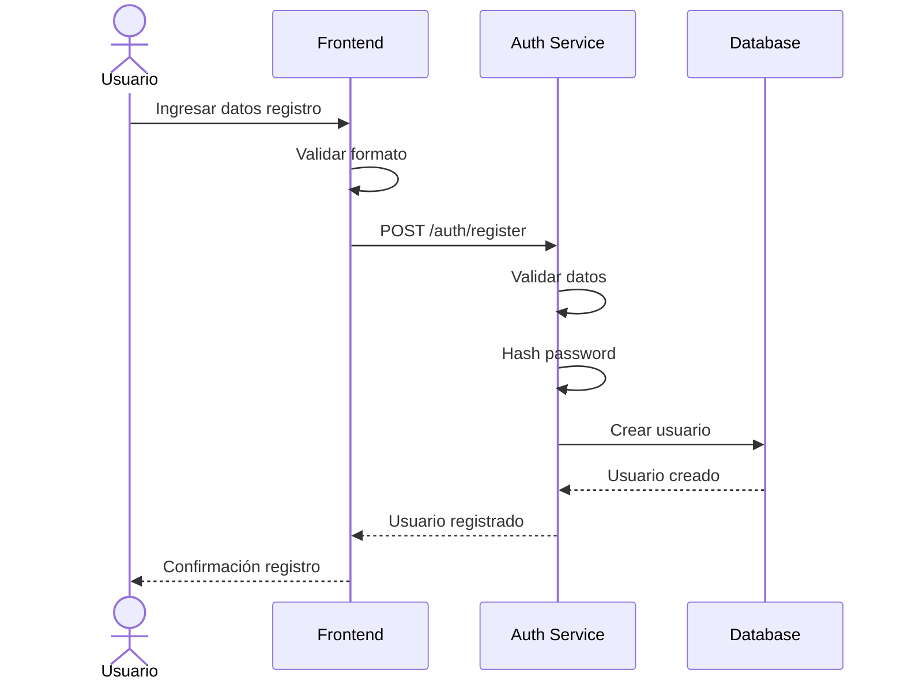

**Precondiciones:**
- Email no registrado previamente
- Datos válidos (email, password, nombre)

**Postcondiciones:**
- Usuario creado en base de datos
- Password hasheada
- Rol USER asignado por defecto

### UC2: Iniciar Sesión

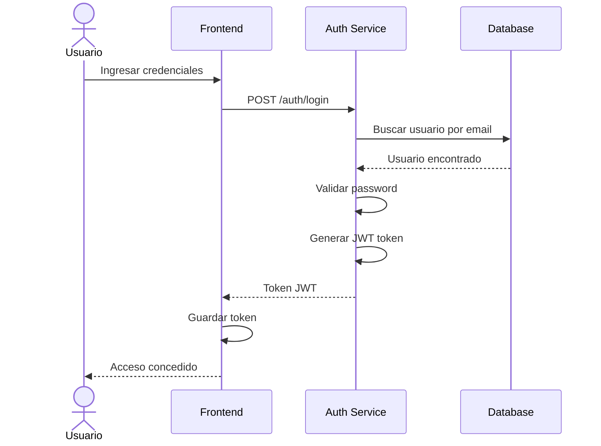

**Precondiciones:**
- Usuario registrado
- Credenciales válidas

**Postcondiciones:**
- Token JWT generado
- Sesión iniciada
- Token almacenado en cliente

### UC3: Gestionar Usuarios (Admin)

**Operaciones:**
- Listar usuarios
- Actualizar roles
- Eliminar usuarios
- Ver detalles de usuario

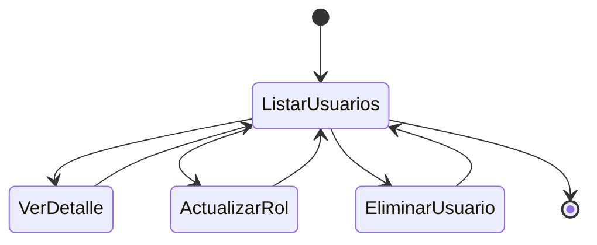

## 📚 Casos de Uso de Catálogo {#catálogo}

### UC4: Buscar Libros

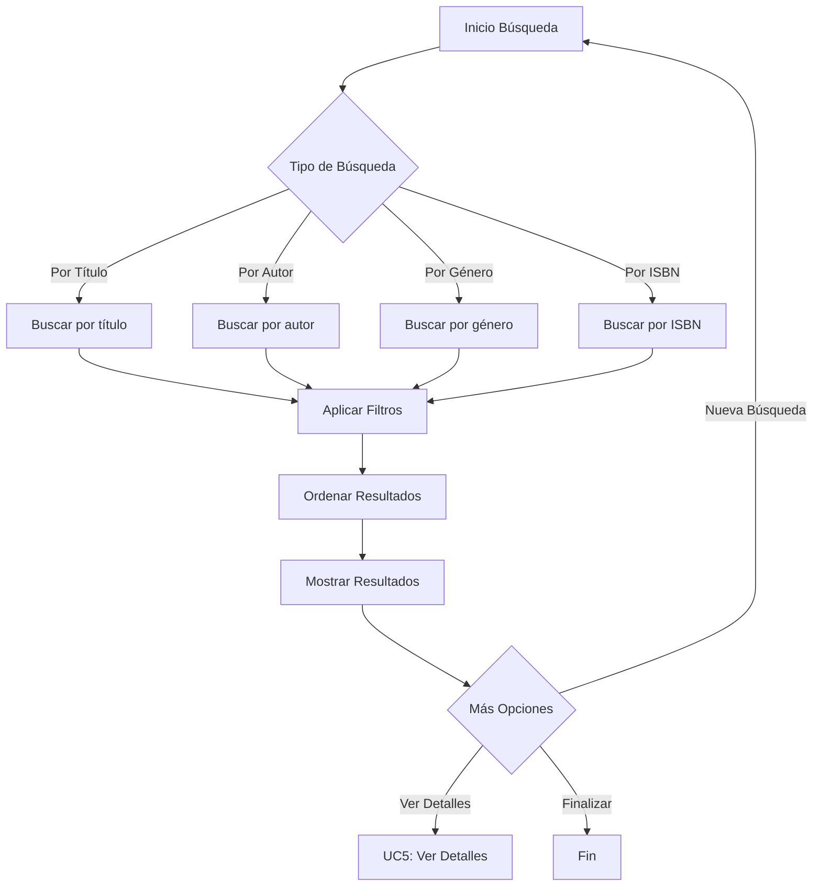

**Filtros disponibles:**
- Rango de precio
- Disponibilidad
- Año de publicación
- Editorial

### UC5: Ver Detalles de Libro

**Información mostrada:**
- Datos básicos (título, ISBN, precio)
- Autor(es)
- Género
- Editorial
- Stock disponible
- Descripción
- Análisis de ventas (si es admin)

### UC6: Gestionar Catálogo (Admin)

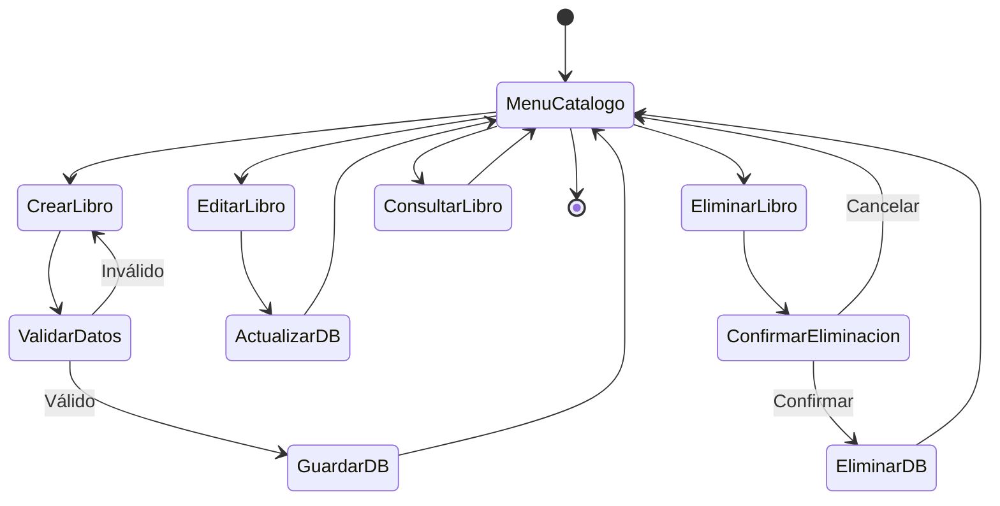

## 💰 Casos de Uso de Ventas {#ventas}

### UC10: Registrar Venta

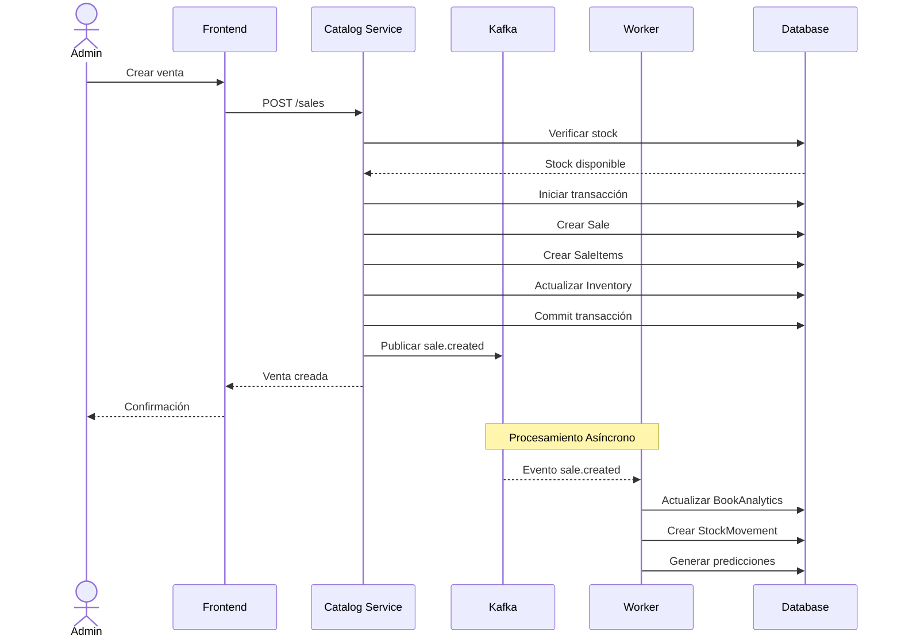

**Precondiciones:**
- Usuario autenticado con rol ADMIN
- Stock disponible >= cantidad solicitada
- Libro(s) activo(s)

**Postcondiciones:**
- Venta registrada
- Inventario actualizado
- Evento publicado a Kafka
- Analytics actualizado (asíncrono)

### UC11: Consultar Ventas

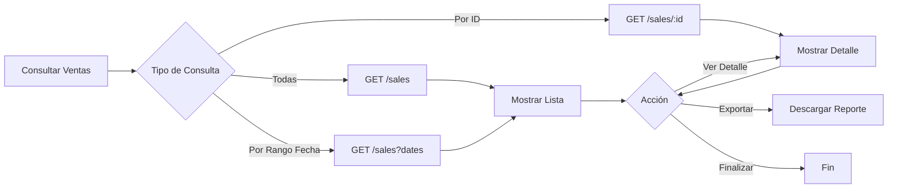

### UC12: Gestionar Inventario (Admin)

**Operaciones:**
- Consultar stock actual
- Ajustar inventario manualmente
- Ver movimientos de stock
- Consultar snapshots históricos

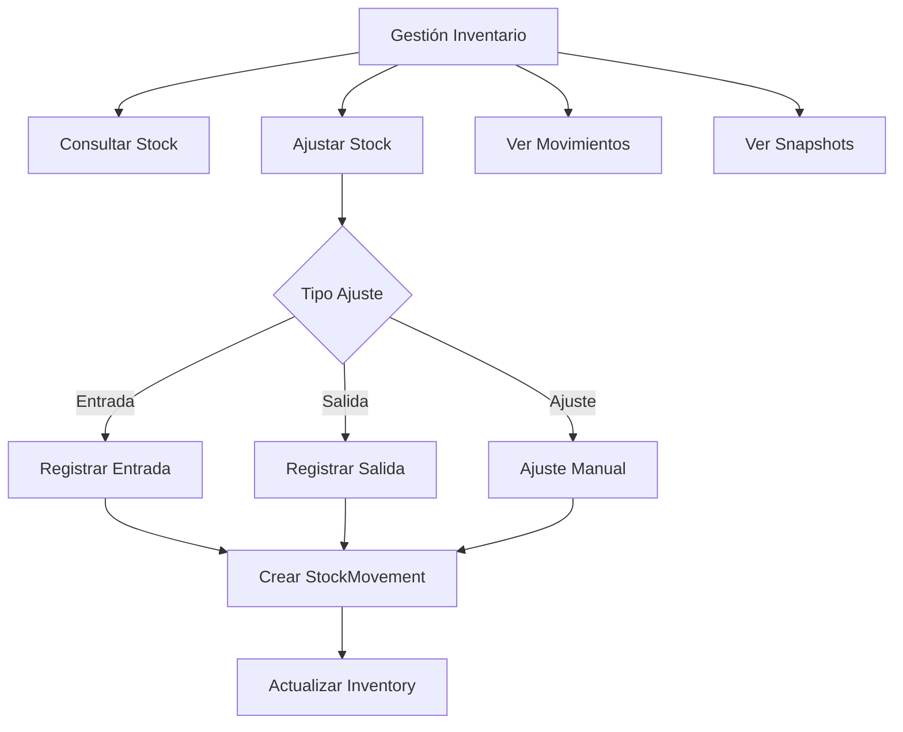

## 📊 Casos de Uso de Analytics {#analytics}

### UC13: Ver Dashboard

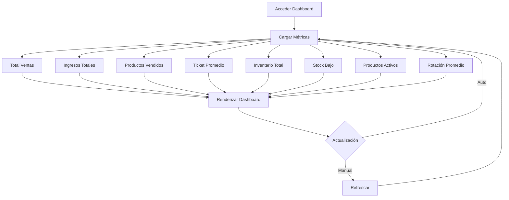

**Métricas mostradas:**
- Total de ventas
- Ingresos totales
- Unidades vendidas
- Ticket promedio
- Valor inventario
- Productos con stock bajo
- Productos activos
- Rotación promedio

### UC14: Consultar Reportes

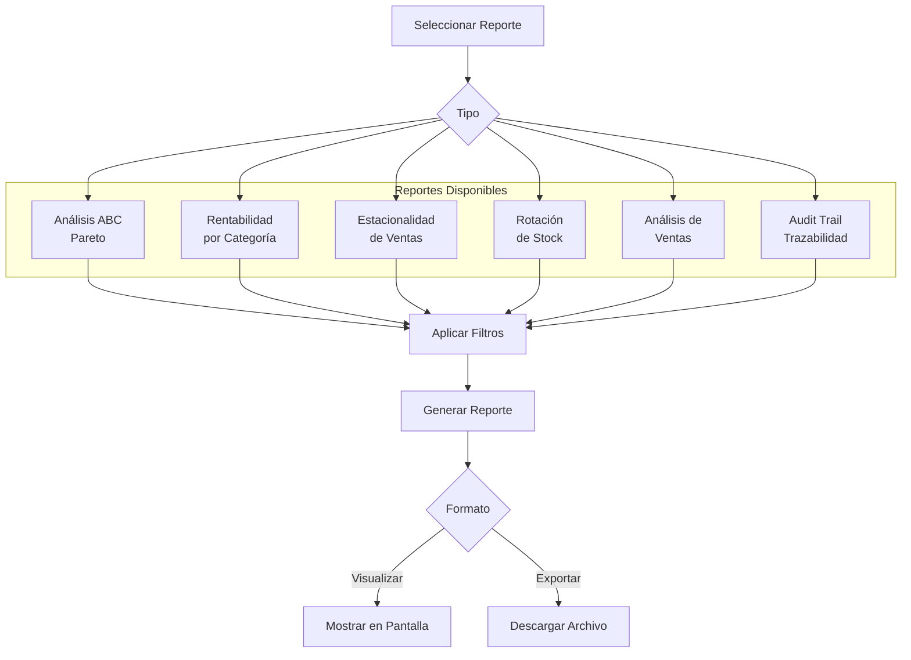

**Tipos de Reportes:**

1. **Análisis ABC (Pareto)**
   - Clasificación de productos A, B, C
   - Por contribución a ventas
   - Top 20 productos

2. **Rentabilidad por Categoría**
   - Ventas por género
   - Margen por categoría
   - Productos más rentables

3. **Estacionalidad**
   - Ventas por mes
   - Tendencias temporales
   - Patrones estacionales

4. **Rotación de Stock**
   - Días promedio de rotación
   - Productos de alta rotación
   - Productos de baja rotación

5. **Audit Trail**
   - Historial de cambios
   - Usuario que realizó cambio
   - Valores anteriores y nuevos

### UC15: Ver Predicciones

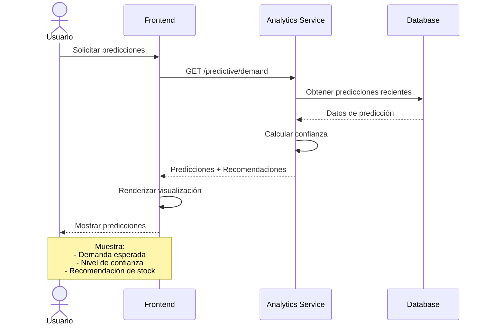

**Información de Predicciones:**
- Libro predicho
- Demanda esperada (unidades)
- Nivel de confianza (0-1)
- Recomendación de reabastecimiento
- Fecha de predicción

### UC16: Gestionar Alertas

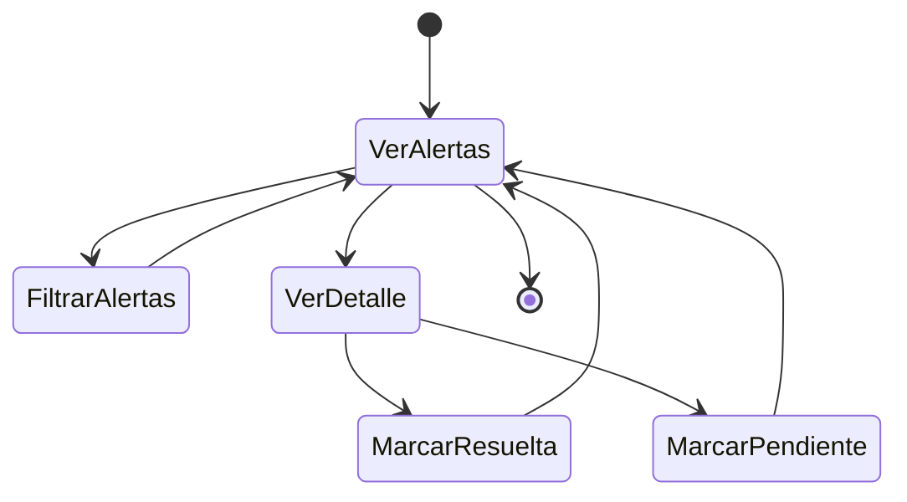

**Tipos de Alertas:**
- 🔴 **LOW_STOCK**: Stock por debajo del mínimo
- 🔵 **HIGH_DEMAND**: Demanda superior al promedio
- 🟡 **LOW_ROTATION**: Producto con baja rotación
- 🟢 **RESTOCK_NEEDED**: Necesidad de reabastecimiento

## 🤖 Casos de Uso del Sistema (Automáticos) {#administrativos}

### UC17: Procesar Analytics (Worker)

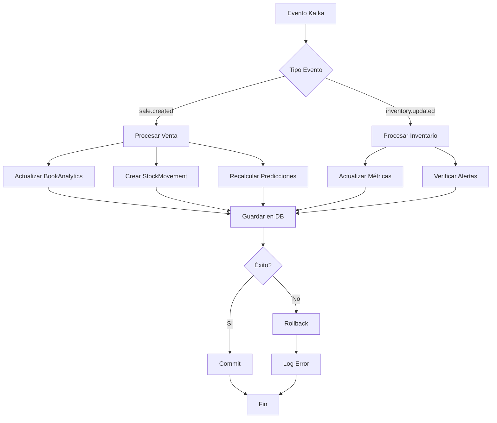

### UC18: Generar Alertas Automáticas (Cron)

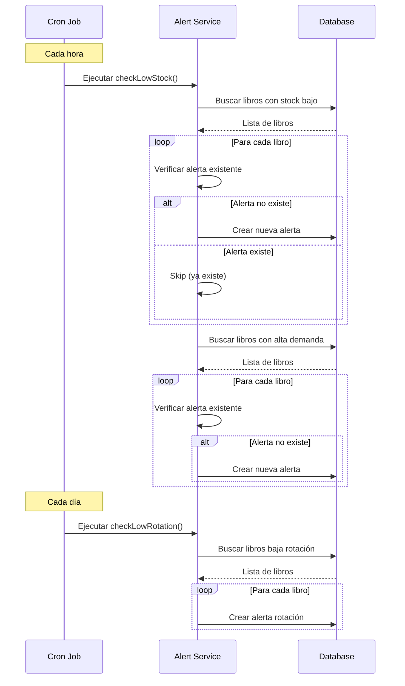

**Frecuencias:**
- Stock bajo: Cada hora
- Alta demanda: Cada hora
- Baja rotación: Diaria (00:00)

### UC19: Actualizar Predicciones

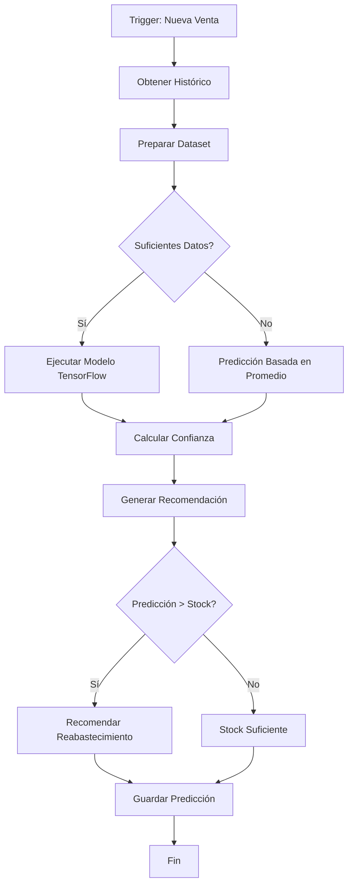

**Factores considerados:**
- Histórico de ventas (30 días)
- Tendencia actual
- Estacionalidad
- Stock actual
- Tasa de rotación

## 📝 Resumen de Actores y Permisos

| Actor | Casos de Uso Permitidos |
|-------|------------------------|
| **Usuario** | UC1, UC2, UC4, UC5, UC10, UC11, UC13, UC14, UC15 |
| **Administrador** | Todos los casos de uso de Usuario + UC3, UC6, UC7, UC8, UC9, UC12, UC16 |
| **Sistema** | UC17, UC18, UC19 (automáticos) |

## 🔄 Flujos Principales vs Alternativos

### Flujo Principal: Compra de Libro
1. Usuario se autentica (UC2)
2. Busca libro (UC4)
3. Ve detalles (UC5)
4. Admin registra venta (UC10)
5. Sistema procesa analytics (UC17)
6. Actualiza predicciones (UC19)
7. Genera alertas si necesario (UC18)

### Flujo Alternativo: Gestión Proactiva
1. Admin ve dashboard (UC13)
2. Revisa alertas (UC16)
3. Ve predicciones (UC15)
4. Ajusta inventario (UC12)
5. Sistema actualiza métricas (UC17)
